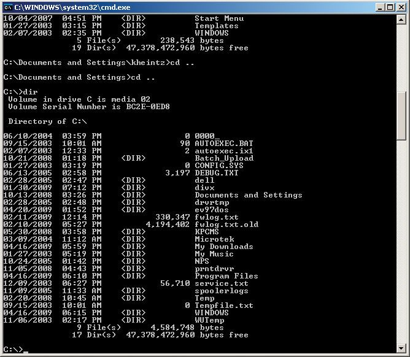
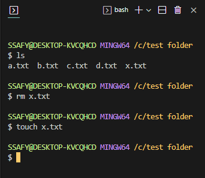
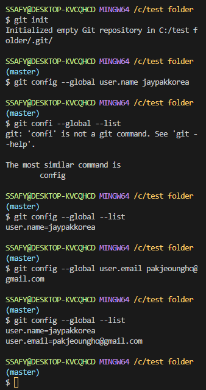

# TJL

> Today Jay Learned


-----

##                                                                                        Time Stamp

-----


### START CAMP

----

> [**Setting_Basic**](https://hphk.notion.site/SSAFY-8-Public-Document-9dc94ea8a050472ca00ffe8ea58586da)

​		개인 노트북에 다운 받기 


> **CODING**


- **While / For** 문 예제

  - 로또 :

    ***1부터 45 사이 숫자 6개를 무작위로 고르고, 이 숫자들이 로또 당첨번호와 같은지 확인하는 알고리즘을***

    ***만들어라.***

    ```python
    numbers = list ( range(1,46) )
    
    import random
    
    winner = [ 10, 14, 16, 18, 29, 35 ]
    
    for chance in range(100000) :
        lucky = random.sample(numbers, 6)
    
        member = 0
    
        for i in range (6) :
            if lucky[i] in winner :
                member += 1
                
        if member == len(winner) :
            print ("정답")
    ```

    ---

    

    ​	***What Jay Learned***

    ​			- 문제 해결을 위한 **Logic** 을 먼저 생각하고, 그 뒤 필요한 Code를 생각하자.

    ***				'어떻게 하면 로또번호 당첨 여부를 확인하는 알고리즘을 짤까?'***

    ***				'먼저 내가 선택한 6개의 숫자 가 당첨 번호에 있나 확인'***

    ***				'그 6개의 member와 winner의 리스트 length가 같은지 확인'***

    

    ​			-  좋은 Code 보단 좋은 **Logic**에 먼저 집중하자.

    

- **Json** 

```python
import requests

url = 'https://api.agify.io/?name=jay'
print(requests.get(url).json())
```


> **Mark Down**

```
#코드 입력법
  1) 인코드 
		` 로 감싸준다
  2) 블록코드
		``` + enter
		
#링크
  [구글](구글주소)
  
  
#이미지
	
	
#인용
	> 입력
	
#표
	파이프 |
	하이픈 - 
	ctrl + T
	ctrl + enter
	
	
#수평선
	--- 복수로 입력
```


> **GIT**

***How does Github make money?***

Freemium Buisiness like Dropbox , Google Drive


**CLI** & **Gui**

Graphic User Interface

Command Line Interface : 명령 프롬포트 (MS Dos)  

]


## 절대경로 vs 상대경로 ##

절대경로 : 루트 디렉토리 ~ 목적 파일 모든 경로가 전부 포함 ex) c:/users/ssafy

상대경로 : 현재 작업중인 디렉토리 기준으로 계산한  ex) /a.txt 

​						./	나					

​						../  상위 폴더 

​						기준점 : c:/users/ssafy/sky/a.txt

​						비교     : c:/users/ssafy/jay/k.txt   

​						표시     : ../jay/k.txt


### GIT bash ###


touch a.txt : 파일 만들기

cd .. : 상위 폴더로 이동 (change diretory)

mkdir 'folder test'

start .

pwd

ls

ls -a : all

ls -l : 더 자세한 정보

mv p.txt x.txt (같은 폴더에서 move 를 하면 파일 명을 바꿈)

mv x.txt ../'test folder'

rm x.txt

<VS Code에서 Git bash>



*** git init***

Working Directory (untracked file)

*** git add***

Staging Area

*** git commit*** -m"남기고 싶은 메시지"  ex) "first commit"

Repository





git init (디렉토리를 수정하겠다)

git config --global user.name (수정자를 입력)

git config --global user.email

git status  

git add ny_project.txt 

git rm --cached ny_project.txt

git commit -m "1st commit"

git add ny_project.txt (수정)

git log (추적)

git commit -m "2nd commit"

git log --oneline


> ## GITHub


local pc 

1. clone (첫날) 2. pull (이후)

git remote add origin = 길을 만들어 주는 작업

git -v  = 길이 잘 만들어졌는지 확인

git push -u origin master = 입력


<<<<<<< HEAD
=======
Git hub에 Push 하기

git remote -v (길 확인)

git remote add origin github 주소

git push -u origin master

git remote remove origin : remote 를 재설정 할 때 지우는 방법


Git hub 에서 Clone 하기

git clone [저장 주소] [로컬에 복제할 위치] 

>>>>>>> 70049840bfab0cb23343c57bbbdd650f5e1a0c6e


### 1_week

-----


<<<<<<< HEAD
=======
- 파이썬

​		인터프리터 언어 _ 한 줄씩 번역

​		객체 지향 프로그래밍 

- 작성 팁

​		`alt` + 클릭 : 한 번에 복수의 문장 작성

- 변수

​		데이터 정보를 담는 상자

- 연산자

​		**/** 나눗셈    **//** 몫    **%** 나머지 

- 진수

  print (**0b**10) **b**inary

  print (**0o**10) **o**ctal

  print (**0x**10) he**x**adecimal

- string

​		\n 줄 바꿈 ex) print ("오늘의 점심 메뉴는\n과연 뭘까요?")


​		name = "Jay"

​		print(**f**"hello {**name**}")

```python
import datetime

today = datetime.datetime.now()
print (f"오늘은 {today:%y}년 {today:%m}월 {today:%d}일")
```


- Boolean 형


- list

```python
box = [1 , 2 , ['apple' , 'banna' , 'cherry']]

print(box[-1][1][0]) #b
print(type(box[-1][1][0])) # class 'str'

# [2:4] 와 같은 표현을 '슬라이싱' 이라고 하며, list, tuple, range ,str 다 사용 가능하다
# [::-1] 은 [start:end:step] 에서 [-1:-len()+1:-1]로 역으로 주겠다는 논리!!!
```


- set

중복값이 제거되기때문에, 고유값의 개수를 구할 때 좋음

```python
a = {'서울', '서울', '부산', '부산', '울산', '대구'}
print(len(set(a)) #4
      
      
      
b = {1, 2, 4, 5}
c = {2, 3, 5, 6}
print(set(b) | set(c)) #{1,2,3,4,5,6}
print(set(b) & set(c)) #{2,5}
print(set(b) - set(c)) #{3,6}
```


- Dictionary

```python
score = {'web' : 90 , 'python' : 80 , 'Django' : 70}

score['algorithm'] = 90
score.update({'python' : 95})
```


- Typecasting


```python
a = '3'
A = 3

a = A  #False
int(a) = A #True
a = str(A) #True
```


```python
print(id(x)) #메모리 주소를 확인 (-5에서 256까지는 id가 같음)


import keyword

print(keyword.kwlist) 

round((3.5 - 3.2), 2) # round(값, 소수점자릿수)


phone_num = { '서울' : '02' , '대전' : '042'}
phone_num.values()
phone_num.keys()
phone_num.items()

a = (1,2)
b = ('a',)
print(a+b)


i = orders.split(',')
menu_list = list(i)
menu_set = list(set(i))
menu_set.sort(reverse = True)
print(menu_set)
```


- 삼항연산자

```python
num = int(input())

print("짝수") if num % 2 == 0 else print("홀수")
```

- 딕셔너리 + for 반복문

```python
chars = { '서울' : '02' , '대전' : '042'}


for char in chars :
    print(char, chars[char])
```

- enumerate +  for 반복문

```python
members = ['영희' , '민수', '철수']
print(list(enumerate(members ,#필요한경우index 시작번호))


members = ['영희' , '민수', '철수']

for idx, member in enumerate(members):
    print(idx, member)
```

- list comprehension

```python
cublist = [number**3 for number in range(1,4)]
print(cublist)
```


- dictionary comprehension

```python
cublist = {}
for i in range(1,4) :
    cublist[i] = i ** 3
print(cublist)

cublist = {i : i ** 3 for i in range(1,4)}
print(cublist)
```


- 반복문 제어

```
for char in 'apple' :
    if char == 'a' :
        print("a!")
        break

else : 
    print("b가 없습니다")
```


```python
# 복수의 parameter를 받을 때 *args *rest를 사용

a = 10
b = 20
def add (*args):
    return a + b

kick = add(a,b)
print(kick) #tuple로 반환


def funk(*rest) :
    return  rest

kick = funk(a, b, 6 , 10)

print(kick) #tuple로 반환
```


- 가변 인자

```
def family(papa, mama, *geschwester) :
    print(f"아버지 {papa}")
    print(f"어머니 {mama}")
    print(f"형제자매 목록")
    for name in geschwester :
        print(f"{name}")

family('박문수' , '서은숙' , ' 박채리' , '박정호')
```


- 가변 키워드 인자

```python
def family(papa, mama, **geschwester) :
    print("아버지 : ", papa)
    print("어머니 : ", mama)
    if geschwester :
        for member, name in geschwester.items() :
            print(f"{member} : {name}")

family('박문수' , '서은숙' , 누나 = '박채리', 누나 = '박주언' , 나 = '박정호')
```


- lambda

```python
def tri (b,h):
    return b * h * 0.5
print(tri(5,6))


tri = lambda b, h : 0.5 * b * h
print(tri(5,6))

```

- 재귀함수 (factorial)

```python
def factorial (n):
    if n == 0 or n == 1 :
        return 1
    else :
        return n * factorial(n-1)
    
print(factorial(4))
```


- join mothod

```python
numbers = [1, 2, 3]

numbers = ''.join([str(i) for i in numbers])
print(numbers)

sky1 = ['a' , 'b', 'c']

numbers = '*'.join([str(i) for i in sky1])
print(numbers)


```


- lambda

```python
list(map(lambda n: n%2, [1, 2, 3]))
```


- 재귀함수 (factorial)

```python
def factorial(n):
    if n == 0 or n == 1 :
        return 1

    else :

        return n * factorial(n-1)

print(factorial(5))
```

- list와  sort 로 최댓값 구하기

```python
def max (*a):
    j = ''
    for i in range(len(a)) :
        j += str(a[i])
    
    a = list(j)
    a.sort()
    return a[-1]
    
print(max(1, 2, 3, 4))
```


- 예제

```python
numbers = [1,1,3,3,0,1,1]


result = []
for idx, items in enumerate(numbers) :
    if idx == 0 :
        result.append(numbers[idx])
    elif result[-1] != items :
        result.append(items)

print(result)

```


### 2_week

-----


### 3_week

-----


 